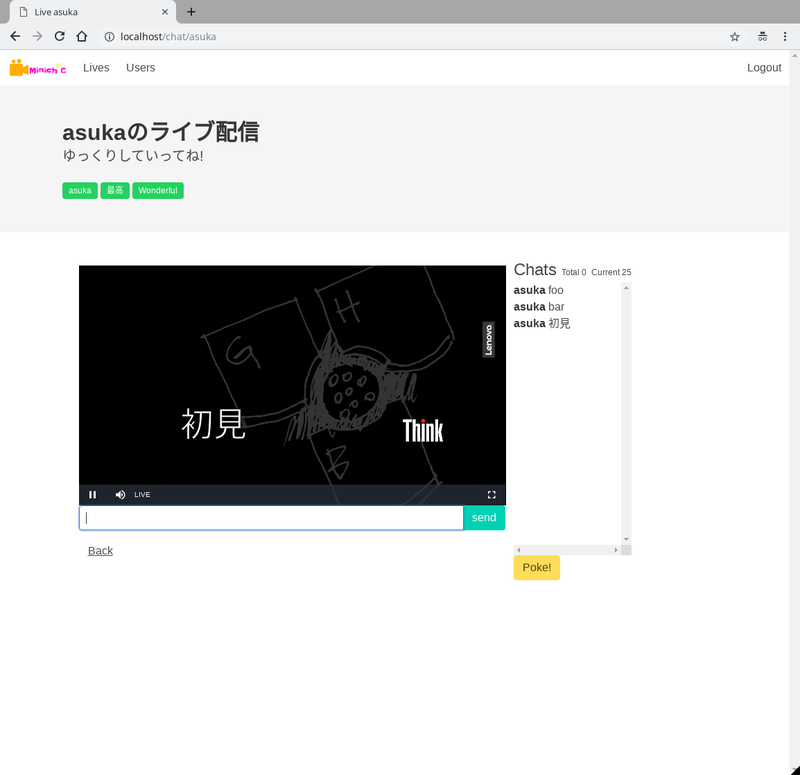

少し遅くなりましたが、サマーインターンについて書きたいと思います。

1. はじめに
2. やったこと
3. インターンを終えて
4. Donutsについて

## はじめに

株式会社Donutsさんのサマーインターンに参加してきました。

期間は9月3日〜9月14日の2週間で、
テーマは「GO言語で作るLIVE配信」

ちょうどGO言語の勉強を始めたということもあり、
「GO言語！LIVE配信！面白そう！」と申し込みました。

GO言語でLIVE配信ってどんな感じなんだろうと…

LIVE配信サービスなんて、
中々作る機会が無いので…どんな事をやるのか、
それはもう興味しかないですよね。

## やったこと

2週間ありましたが、
そのうち約8割は講義がメインでした。

- GO言語
- Docker
- RTMP・HLS
- Redis
- GO言語・テストコード

講義の内容はざっくりこんな感じでした。

### GO言語

おさらい&echoライブラリの使用について…

さらっとおさらいをした感じです。

### Docker

個人的には今回一番勉強になった部分です。

正直言って、GO言語のインターンというよりも、
インフラ構築のインターンだったのでは…と思っています（笑）

本当に。

いや、よくよく考えたらそうなんですけど、
LIVE配信やろうとしたらそりゃインフラ重要ですよね…うん。

### RTMP・HLS… 

これが無いと始まらない、LIVE配信。

頭の上にクエスチョンマークを大量生成した部分（笑）

npmパッケージ使えばお手軽だよね！うん！そうだね！完全に理解したわ…

正直、
インターン期間中に理解しきれなかったというか…
やろうとしていることは分かるんですけどね…

### Redis

へー、これがno-sqlってやつかー。

初めて使いました（笑）

今までmysqlとsqliteをいい感じに使い分けようかなぁって思っていたのだけど、
Redisも交えて使い分けたら良い感じになりそうだな、と。

今回はチャット機能の実装に使用しました。

### GO言語・テストコード

初めて書いたよ…テストコード…

やっぱり書かないとダメだよね…

カバレッジの表示の部分、かなり良い。

テストコードはちゃんとやらないとなー。

今度GO言語書く時に書いてみよう（笑）

こんな感じの内容の講義を行った後、
2人1組のチームを作り追加課題を開始。

LIVE配信・チャットルームの実装は講義でほぼ形になっていたので、
後はどのブラウザでも表示可能にしたり、
ギミックを仕掛けたりといったところを行いました。

HLS は Apple が開発したストリーミングプロトコルで、
ブラウザは Safari と Edge しかネイティブ再生出来ないみたい。

なので、そこら辺をどのブラウザでも再生出来るようにしてみたり…

あとは、ニコニコ動画みたいなコメントを流す機能を実装しました（笑）

## インターンを終えて

今回のインターンはかなり勉強になりました。

毎回の講義の情報量が非常に多く、
ついていくのがやっとだったのですけど…

周りのレベルが非常に高かったです…
はい。

まだまだ全然足りない、
ということを改めて実感したインターンになりました。

個人的に、
一番大きな収穫はインフラに興味を持てたことかな、
と。

サーバーサイドプログラミングしたいなら必要だよね、インフラ…

まー、
Docker環境をだいぶ組めるようになったのは大きい。

## Donutsについて

去年までゲーム系のインターンをやっていて？
今年初めてWEBエンジニア向けのインターンだったようです。

1期生だ、わーい。

最後にチーム開発を行いましたが、
内容的には講義がメインのインターンでした。

開発メインのインターンとなると、また違った形になりそう…

企業としてても、
個人的にはかなり魅力を感じてはいます。

勤怠管理・電子カルテ事業というのは興味をそそられます。

2B事業もいいのですが、
今回のインターンで新しいことを学ぶのが自分は好きなんだな―と感じたので、
2CのWebサービス事業も捨てがたい…

そこは少し悩みどころです。

Donutsさんはどちらも、技術にアンテナを貼っているエンジニアが多いのかな？
と感じたので、学びの多い企業だとは感じました。

## おまけ

本来関係無いので、
ここに書くのもどうかと思ったのですが、
この記事を書いていて、あまりにもUIが酷いな、と。

早めい整備します…
