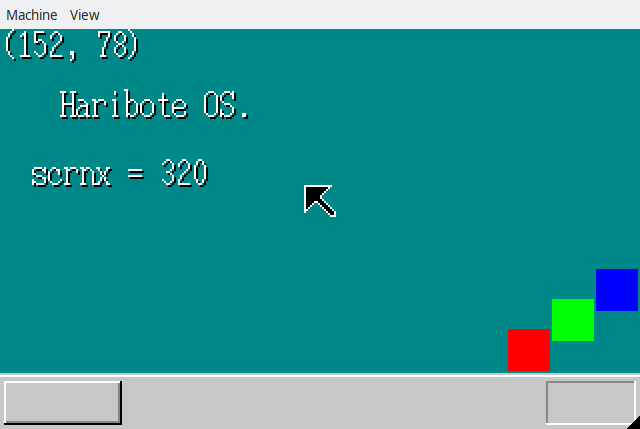

５日目の完成物

４日目に画面をカラフルにしたので、
文字やマウスカーソルを表示してみよう〜といったもの

ちなみに、 このマウスカーソルはまだ動かない

C言語のポインター計算は優秀らしく、 ８バイトの配列が有った場合に、
ポインターに`+1`すると１バイトではなく８バイト分進むらしい

すごい

上書きされないのか心配してたのだけど杞憂だったらしい

文字列は最後に`0x00`が付いたものらしい
`"ABC123"`といったコードは`c != 0x00`といった終了条件でループを回せるらしい

ただ疑問だったのが`char[1][6] s = { "ABC123" };`
みたいなコードが`7`ではなく`6`なのはなんで？な部分... おいおい調べようかなと
