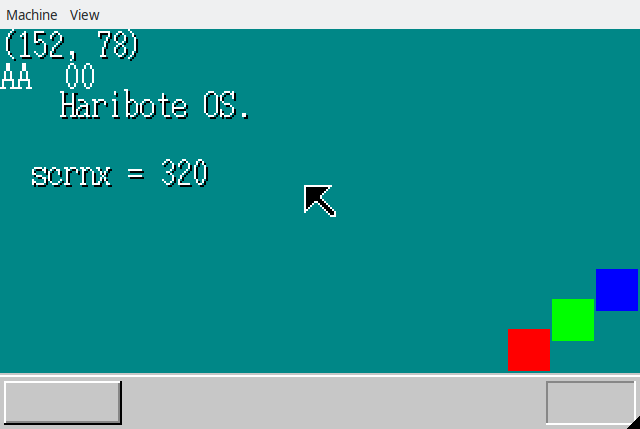

## 7日目の内容

1. キーボードの入力信号の受け取り
1. マウスの入力信号の受け取り

## 入力信号の受け取り

マウスorキーボードから信号が送られてきた場合に、
それらを受け取って表示する処理をを作成

1. マウスとキーボードそれぞれのバッファ領域を用意
1. 割り込み処理は受け取った信号をバッファに流し込む
1. メイン処理はバッファに値が入っていた場合に 値を取り出して表示

バッファ領域を作ってみたのが今回一番の学びかもしれない

## 成果物

