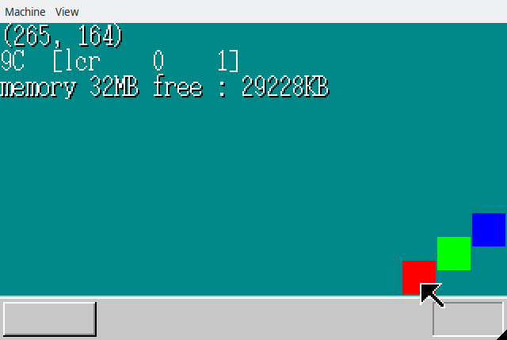

## 10日目の内容

- メモリ管理の修正
- 重なり制御

## メモリ管理の修正

前回のメモリ管理方法だと、細かく管理できる半面細切れの領域が多く出来ることが予想されるため、
まとまった領域毎にメモリを確保する方式を追加

## 重なり制御

マウスの移動の度に移動箇所が上書きされているのを修正

具体的にはレイヤー構造を取り入れて、レイヤー毎に表示制御を行うというもの

後は、書き換え範囲を小さくしたりなどして画面の高速化を行ったり

## 成果物

## 他

マウスの挙動が変だなとずっと思っていて、
今回見直した所、計算が間違っていたことが判明

修正したら非常に快適になった
