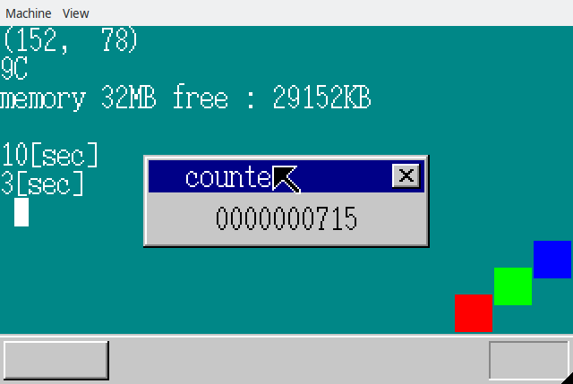

## 13日目の内容
主にリファクタリングを行うのが今回の内容でした。
キーボード・マウス・タイマーのバッファを1つにまとめたり、
合わせて処理の最適化をしたり...
バッファを1つに纏めるに当たり、バッファサイズを 8-bitsから 32-bitsに引き上げたりしていました。

## 久しぶりに詰まった
こういうときのために書き始めたんだよなーといったような出来事でした。
さて、今回のリファクタリングをいろいろ施して行った結果、
マウスなどの割り込み処理を一切受け付けなくなってしまって途方に暮れてました。
普段typoが多いので、そのへんを合わせて入念に調べてみたりしていたのですが、
該当箇所が見当たらず...

ただ、割り込み処理を許可してから、割り込み処理を拒否するまでの間に画面を書き換えるなどの
(コンピュータにとって)時間のかかる処理を挟むと割り込み処理が動作することが判明
(なんだそれ)。
このことから、割り込み可能な期間が短すぎて誰も割り込みが出来ていないんじゃないかという
仮説を立てたのですが、確証には至っていません。
結局よくわからなかったなーと...

対策として、割り込み許可後(STI)に処理待ち(HLT)を挟むことで解決。
ただ、これではこの章にあったベンチマークを測定できないじゃないかということで、
割り込み制御を消して実行
(書籍が書かれたときに使われているPCが約20年前のものなので、
書籍の写真として写っていたものと比べると驚異の速度を記録)

なんとも煮えきらない形でこの章を終えるに至りました。

完

## 成果物
HLT命令を挟んで実行したもの
(当然ながら、ベンチマークに用いたカウンタスコアが低い
...マウスやキーボードの入力を挟んだりするとだいたい2000台行くかなーといった感じ)

割り込み制御を消して実行したもの
(書籍の実機測定値の20倍!
...割り込み制御の有無による影響がどの程度あるのかわからないのですが、
ほぼ無いんじゃないかな？と思っています)

