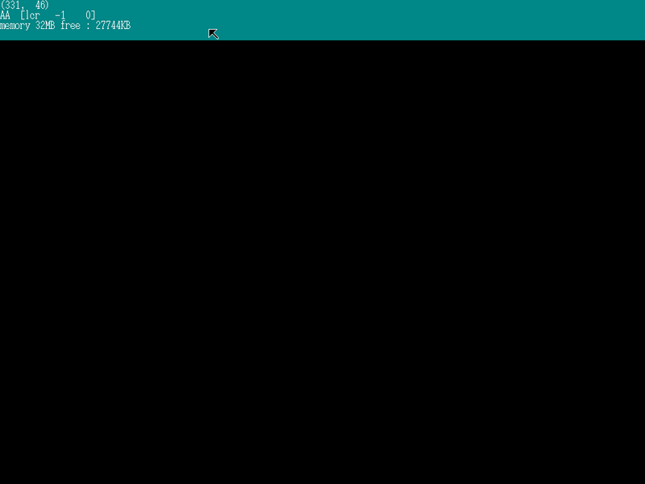
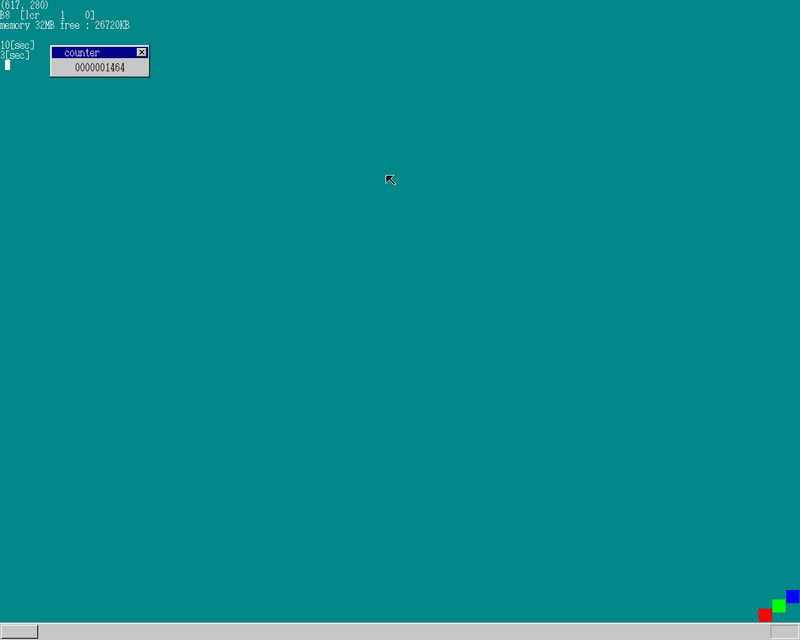

- 13日目の内容確認
- 高解像度化
- 余談

## 13日目の内容確認
タイマーの処理が本当に改善されているのかと言う内容の確認  
なにがどうベンチマークに関係しているのかという説明をしてくれている  
おしまい

## 高解像度化
今回この箇所で詰まったので、
ひとまずここまでで一区切りつけてまとめることに

今までずっと320x200だったので、
これを高解像度化するという内容  
具体的には、 VESA という規格に対応しているBIOS
(VESA BIOS extention: VBE)に対応しているかどうか調べて、
対応していれば高解像度化する...といった内容

### qemuのバージョン
まず、最初のサンプル通りにプログラムを書くと、
期待通りの動作にならない...
```text
; 書き換え前
        MOV     DWORD [VRAM], 0x000a0000
; 書き換え後
        MOV     DWORD [VRAM], 0xe0000000
```

実行すると、確かに画面は広くなってはいるが、
真っ黒...なぜ
VRAMに問題があるのかなと思い `0xe0000000`を `0x000a0000`に戻すと
映るがなにかおかしい...  



#### 0x4000
[引用: OS Dev](https://wiki.osdev.org/VESA_Video_Modes)
> INT 0x10, AX=0x4F02, BX=mode, ES:DI=CRTCInfoBlock
>
>Set Video Mode. Call this with the mode number you decide to use. If you choose a mode that makes use of a linear framebuffer, you should OR the mode number with 0x4000. This sets the "Use LFB" bit in the mode number. Set the bit 11 of BX to instruct the BIOS to use the passed CRTCInfoBlock structure, see the specification for more information.
BIOSs can switch to protected mode to implement this, and might reset the GDT. This is observable on QEMU 2.2.x.

(本書によると)
VBEには `0x101`, `0x103`, `0x105`, `0x107`と画面モードがあるらしく、
これに `0x4000`を足すことで LFB(Linear Framebuffer: LFB)フラグを立てて有効にするらしい  
これは画面に扱うデータをどういう風に扱うか？という話らしく、
名前から推測するに、
シンプルでわかりやすい形式ということでしょう
画面モードに関しては他にもいくつかあるが、
本書でこれら４つが紹介されているのは 8bitsカラーによるもの

ちなみに、 `0x107`はqemuではサポートされていないと書かれているが、
最近のqemuだと問題なく動作する

#### 0x000a0000
[引用: OS Dev](https://wiki.osdev.org/Bochs_VBE_Extensions#Using_a_linear_frame_buffer_.28LFB.29)
> Using banked mode  
When using banked mode, the BGA uses a 64Kb bank size (VBE_DISPI_BANK_SIZE_KB) starting at address 0xA0000 (VBE_DISPI_BANK_ADDRESS). Banked mode is the default mode, so when enabling the VBE extensions without explicitly telling the BGA to use a linear frame buffer, the BGA enables banked mode. To set the bank to use, write the bank number to the bank register (VBE_DISPI_INDEX_BANK (5)).

`0x000a0000`から始まる領域は64Kbしか読まれないらしい  
(だから中途半端な画面表示になったのか...)

#### 0xe0000000
[引用: OS Dev](https://wiki.osdev.org/Bochs_VBE_Extensions#Using_a_linear_frame_buffer_.28LFB.29)
> Note: In older versions of Bochs and QEMU, the framebuffer was fixed at 0xE0000000, and modern versions will use that address when emulating ISA-only systems. It is highly inadvisable to make assumptions about the address of the linear framebuffer. It should always be read from the BGA's PCI BAR0.

`0xe0000000`を決め打ち指定出来るのは古いqemuだけで、
最新のqemuはPCIからvramのアドレスを取得しろ...とのこと  
(PCIから取得ってどうするの??)

ひとまず、原因はいろいろわかって調べようとしたのだけど、
事前知識が乏しくPCIの仕様みてもｻｯﾊﾟﾘだったために諦めて読み進めることに

### 実機に合わせて解像度を変更する
機種によって扱えるモードが異なるので、
それに合わせて使うモードを変更しよう〜というのが続きだったのですが...
なんと、これ調べたときに説明されていたPCIから読む内容と一致しているじゃないですか...

いろいろと意識が抜けていて少しおさらい

#### INT命令
BIOSに情報の問い合わせを行う関数だとばっかり思っていたのですが、
ここで行っていることがPCIへの問い合わせということだったらしい
(なるほど??)  
本書の内容を読み終えているのであれば、
[ここ](https://wiki.osdev.org/User:Omarrx024/VESA_Tutorial)
を見てみると良いかもしれない  
特に次の3箇所について
1. FUNCTION: Get VESA BIOS information
1. FUNCTION: Get VESA mode information
1. FUNCTION: Set VBE mode

うぉおおってなった...
(いろいろ繋がった)

#### EAXレジスタ
これで動くと思って喜んでいたらコンパイルエラー
(なんで...)  
いつもどおりtypo確認したが違うらしく...
(typoも有ったけど)  
泣く泣く付録CDの実装例を確認してみた所....(!!)

```text
[INSTRSET "i486p"]
```

思い出したぞ...
1年前に、16bits -> 32bitsにするときに!
有効にしたやつだ!!
(そういうことか、完全に理解した)

そんなこんなしていたら、
ついに起動に成功  



## 余談
調べているときにqemuのバージョンとかによる引数ないかなーとか見直していたのですが、
ずっと `qemu-system-i386`を利用していて、なんでだろうって思っていたんですよね...  
たしか、16bitsモードのときに必要だったからi386を利用してたはずで、
今は32bitsモードにしているから `qemu-system-x86_64`で動くのでは？
と思い変更したところ、無事に動作することを確認したのでご報告
