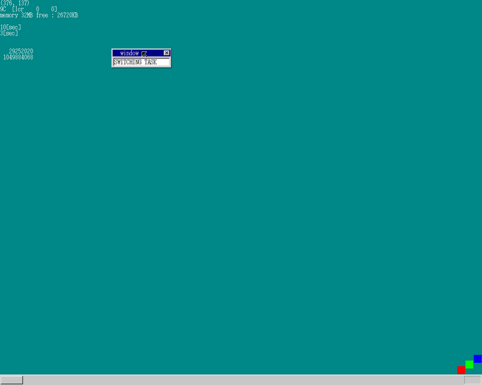
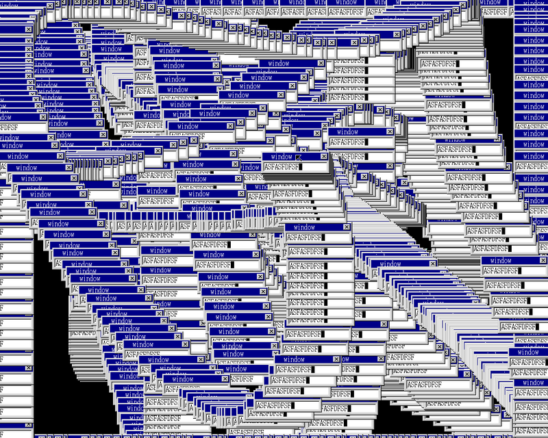

前回から空いてしまったが...

- マルチタスク
- 今までと何が違うの?
- 余談

## マルチタスク

ついに、という感じ\
マルチタスクは16日目でも扱うらしい\
２つの関数を用意して、それを0.02秒毎に切り替えて実行する処理を作成

```c
void task1 (void)
{
    // foo
    for (;;) {
        // bar
    }
}

void task2 (void)
{
    // foo
    for (;;) {
        // bar
    }
}
```

この２つを切り替えて実行する

## 今までと何が違うの?

今までは１つのタスク内で割り込みが来たときにその内容を確認して処理するとしていたが、
１つの関数の中で処理を制御するのではなく、別々の関数で個々の処理を実行する
(この関数を交互に切り替えることによって、1関数内を複雑化するのを防ぐことが可能?)



`*[sec]`の下２つの数値表示処理が今までとは別関数で切り替えながら表示されている部分

## 余談

書く場所間違えてうっかり恐怖画像を作成してしまったorz


