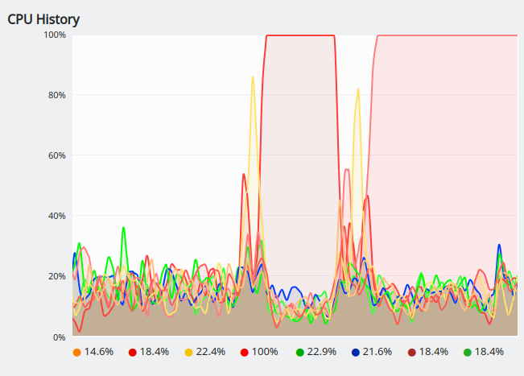
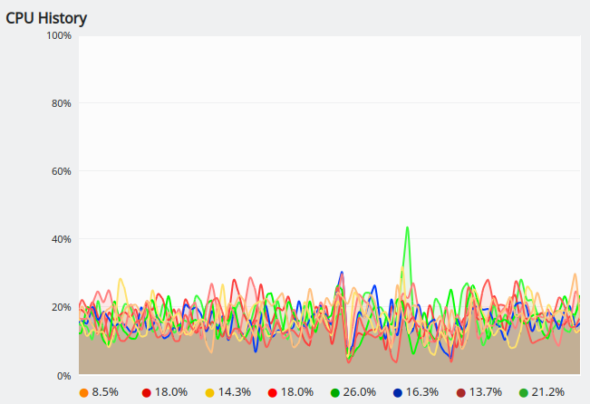
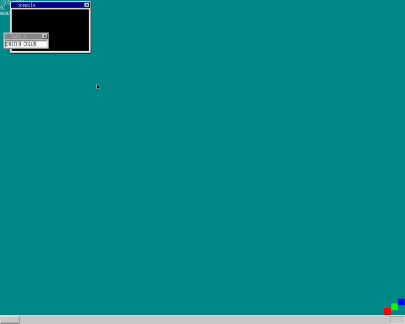
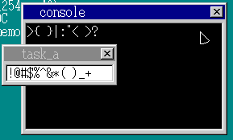
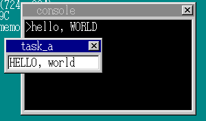

- idle
- コンソール
- 大文字/小文字, Shift, CapsLock...

## idle
何もしていないときにidle状態にしましょうねーというもの  
ビフォー・アフター  

  

  

CPU使用率が下がっていることを確認(ヨシ)

## コンソール
前回の要領で別タスクのコンソールを用意

  

## 大文字/小文字, Shift, CapsLock...
あとはメインタスクで受け取った入力をコンソールへ流したり、
Shift, CapsLockなどを有効にしたり等など

  

  
