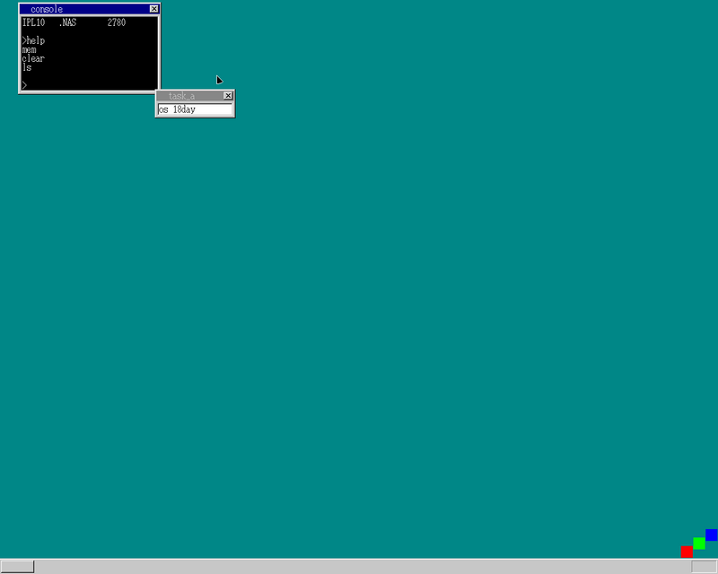

せっかくコンソール作ったので、コマンド実装しましょうという内容  
章では `mem`, `cls`, `dir` の3つのコマンドを実装しているが、  
それぞれUNIX風に `mem`, `clear`, `ls`と名称を変更し、
コマンド一覧を表示するための`help`コマンドを実装

`ls`の実装にあたって、
[Linuxで始めるOS自作入門: 1日目](/blog/self-made-os-1day/)
の内容が少々役に立った

-完-

