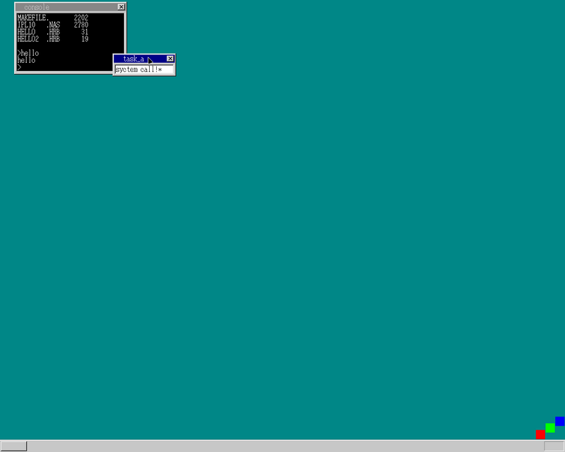

前回から1ヶ月も経ってしまっている(反省)

## 内容

1. 任意のアプリを実行できるようにする
1. APIの実装

## 任意のアプリを実行できるようにする

この辺はほぼリファクタリングです\
今まで実行ファイルをリテラルで直書きしていたのを
ファイル検索してあれば実行、なければエラーとする処理を追加した感じです

## APIの実装

APIと言っていますが... `syscall`の方が馴染みがあるかもしれない
consollに文字を表示する処理をOS側の機能として用意し、
アプリはそれを呼び出すだけで文字を表示出来るように\
(この辺は楽しい)

またnas2hrbをわすれていたので

```bash
nask hello.nas hello.hrb
```



## 余談

反省しています
