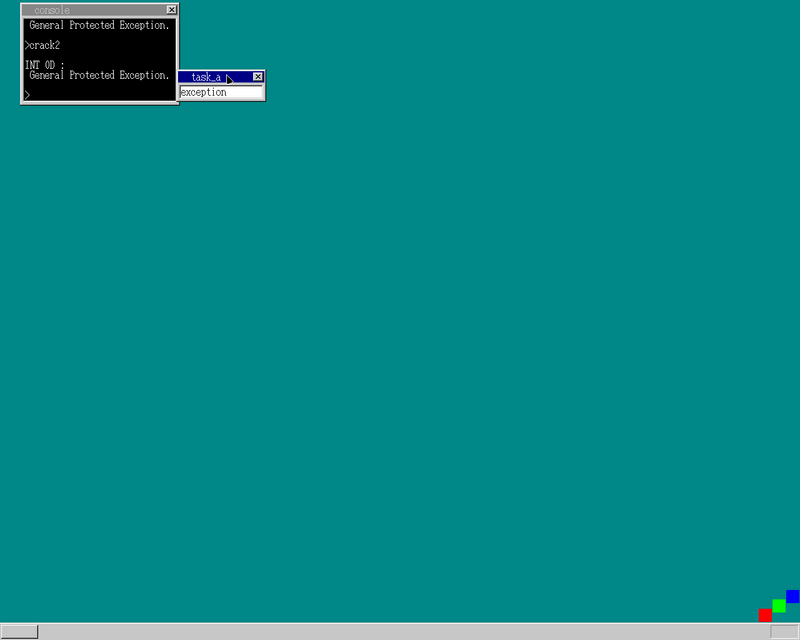

## 内容

1. C言語でアプリを作る
1. OSを守る

## C言語でアプリを作る

前回まで作成していたアプリはアセンブリで記述していたため、
Cで書きたいよね、ということでC言語から作成したアプリを実行できるように修正\
CからAPI(syscall)を呼べるようにしたり (`#include <std.io>... print(...);)`
とかってこんな感じなのかな？と少し感動)

## OSを守る

余り詳しくは無いのですが...
今まで作成していたのは全てLinuxでいうカーネルモードで動作していたため、
ユーザーモードで動作するように...という感じ\
ユーザーモードで動作しているときにOSのメモリ領域の書き換えなどを行おうとした場合に、
強制停止& `Exception`を投げる処理を追加
(`Exception`が出てきたので個人的にはテンション上がった)

## 余談

(10月中に25日目まで終える)\
Kubuntuを `18.10`, `19.04`, `20.04`と順当にバージョン上げたのですが、
`20.x`はメーカーファームウェアアップデートとかが降ってきて個人的に嬉しかった
(ThinkPadの調子が良くなった)
