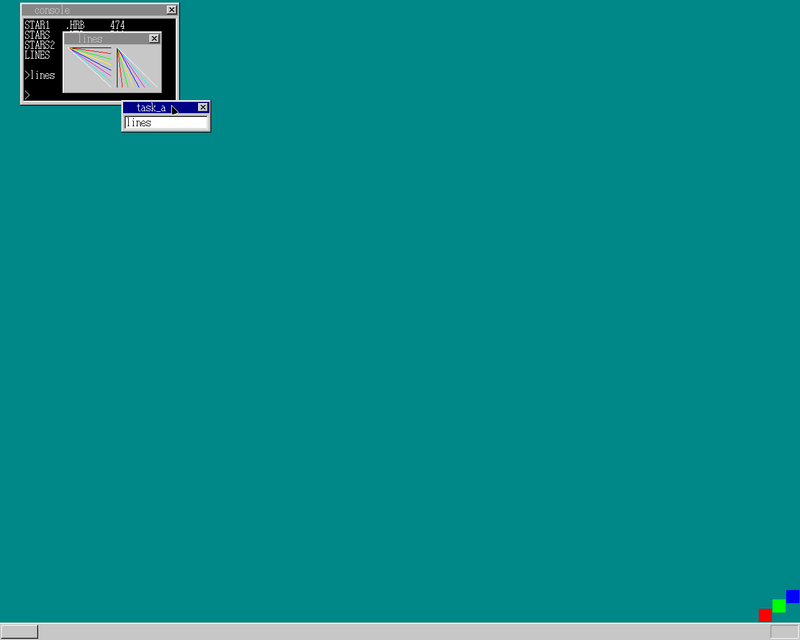
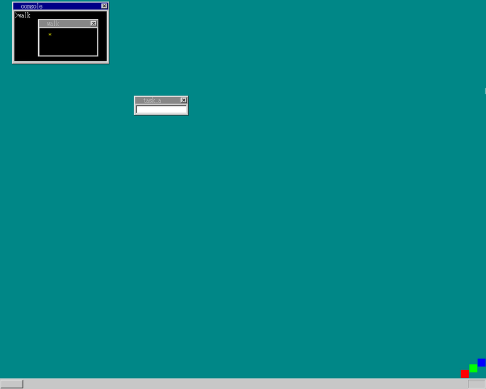
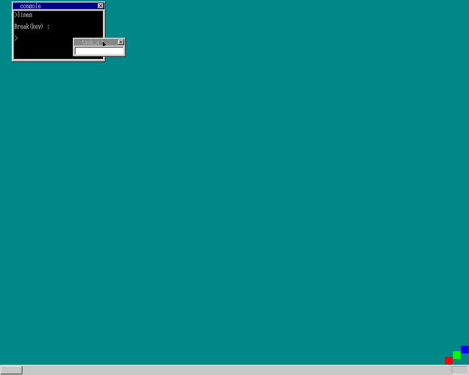

## 内容

1. malloc
1. 線描画
1. ウィンドウのクローズ

## malloc

前回のアプリは、ストレージ上に使用する領域分のサイズを持っていて、
それをメモリに読み込むようになっていたので、バイナリデータが大きかった...
なので、これをアプリ実行時にメモリ領域を確保する方式にしよう、ということで
`malloc`を実装

## 線描画

ウィンドウ上に線を引くためのapiを実装

## ウィンドウのクローズ

今まで画面にずっとウィンドウが出っぱなしだったので、
`enter`でウィンドウを閉じるように\
キー入力をアプリに渡すapiの実装

## 余談

どこか、処理を間違えている気がするんだよね...

