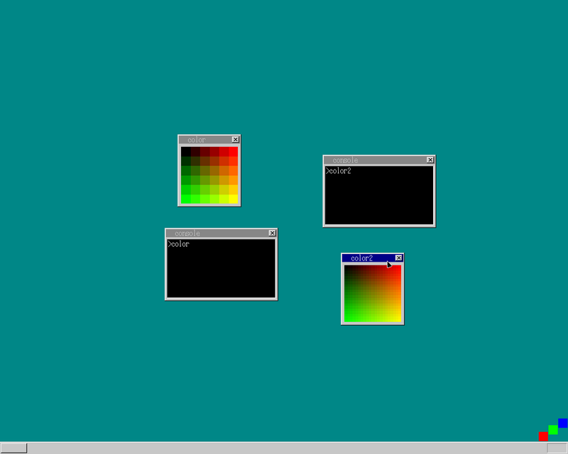

## 内容

1. beep sound
1. 色を増やそう
1. コンソールを増やそう

## beep sound

音を鳴らそう、というやつ

この内容、QEMUだと音のエミュレートが無いので出来ないよーという
本書の説明だったのですが...
この本書かれたのが15年前で、最新のQEMUでそんなわけ無いじゃんと...

で、音はなりました。
ちなみに`qemu beep`で検索すると本書25日目の内容の日本語記事が大量にヒットするのですが
(世の中は車輪の再発明が流行っているらしい)
日本語の記事はだいたい宛にならないので無視しましょう (この内容ももれなく)

2009年のアーカイブにQEMUでBEEP鳴らす内容について言及されたアーカイブを発見:
[Re: Question about KVM and PC speaker](https://lists.nongnu.org/archive/html/qemu-devel/2009-04/msg01499.html)

この内容によると、 KVMで良い感じに音鳴らせるらしい

> The environment variable QEMU_AUDIO_DRV=alsa is set and I run KVM with the
> option -soundhw all.

とまぁ、これでLinuxは音が出ました

```bash
env QEMU_AUDIO_DRV=alsa qemu-system-i386 -m 32M -vga std -serial stdio -enable-kvm -soundhw all -fda haribote.img
```

少し前に x86モードでも動くことに言及していたんですが...
なんだかよくわからない警告が出ていたので、 i386に戻しています (おそらく
16bitsモード関連の警告と思われるが、深堀していない)

## 色をふやそう

サクッと255色に増やして... さらに色の合成によって中間色を生成するというもの
`color`と`color2`は同じ色しか表示していないんですが...
(道理で電子ペーパはグレースケールの16階調なのにグラデーションがあるように見えるわけだ)

## コンソールを増やそう

タイトル通り、見ての通り... ついでに`task_a`ウィンドウ消しました

## 余談

25日目までの内容を10月中に終わらせるという目標を達成したので、
次は11月前半でこの本を終わらせます\
ところどころバグを仕込んでいるような気がしてならない (動いているからヨシ)

いつも何かしらのtypoに恐ろしく時間を使ってしまうのですが... 今回謎の
`GENERAL PROTECTED EXCEPTION`が出まして... そんなわけ無いじゃんと思いつつ...\
これはtypoではなく、横着して作ったアプリ消さずに全部読み込んでいたかららしく、
いくつかアプリを読まないようにしたら解決
(そもそも色々とおかしい部分が多々あるのですが)

動いているからヨシ(2回目)


