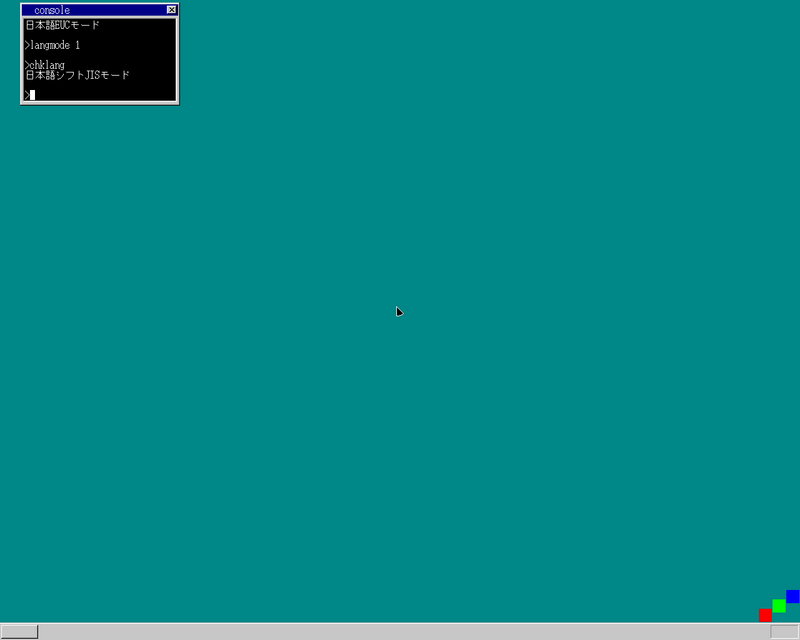

## 内容

1. alloca関数
1. ファイルAPI
1. 日本語表示

## alloca関数

PC用のCコンパイラは4KB以上のスタックを確保するためにalloca関数を呼び出すらしい
(なので実装してあげないといけない)  
とはいえここでやっているのはなんちゃって実装なんですが...  
この関数があると、アプリが予めストレージ上に確保している領域をメモリ上に読み出して使うのではなく
アプリ起動時にスタック領域(配列の展開など)を確保することが出来るようになるので、
アプリのサイズを小さくすることが出来ます
(めでたい)  

## ファイルAPI

アプリからファイルを読み出すためのAPI実装です。
(`fopen`, `fclose`とよばれるようなやつ)  
APIの実装はなぜか毎回感動する  
このAPIが実装されたため、 `cat`はOSのコマンドからアプリへ置き換えたりしています

## 日本語表示

日本語表示できるとかもうなんかすごいですよね。
(フォントデータ作るのは面倒なのでパクってきましたが)  
日本語表示は3節に分かれており、
それぞれ半角表示、全角表示(shiftJIS)、EUCとなっています。
フォーマット2つに対応してるのすごいなーと思いつつ、
shiftJISよりEUCの方がJIS漢字コードへの落とし込みが簡単だというのがなんだか以外
(流石にUTF-8対応を独自にやるのは辞めておきました...が次OS作るときはUTF-8対応します)

## 余談

まだ2日(章)ありますが、
28日(章)でここまでの実装の内容が詰まっているのすごい
(小並感)

