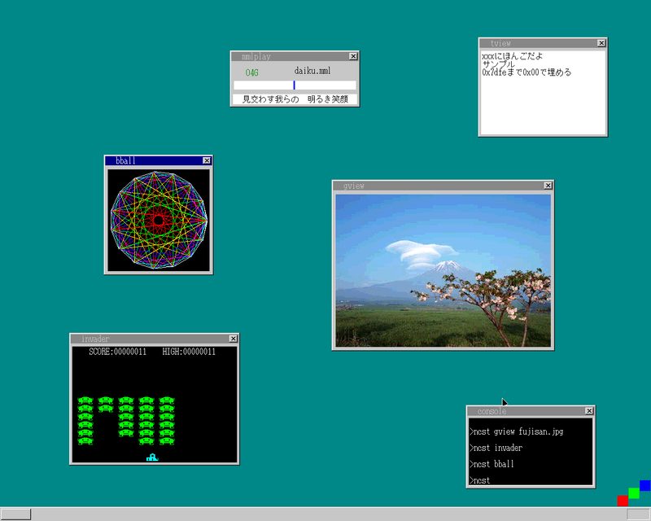

ついに30日目... この章はほぼアプリの実装です。

- コマンドライン計算機
- テキストビューア
- MMLプレイヤ
- 画像ビューア

これらのアプリをこの章で実装しています。\
OSの作成は29日目で(ほぼ)終わっていたため、
29日目後半から30日目の内容は食後のデザートといった感じで、
`ここまでOSを実装するとこういうアプリが作れるんだぞ`といったデモに近い内容です。
(とはいえ、実際に目に見えて動いているものが出来上がるのは楽しい)

最初にこの本を始めたのが2019年の4月頃で、
その後1年ほど空いて今年に入ってから再開、 ここ直近で一気に終わらせました。
(なんだか達成感がすごい)

この本をやり終えた感想のようなものは別途まとめて公開しようと思います。
(今後やりたいこととか)\
ここまでお疲れ様でした。\
そしてありがとうございました。

